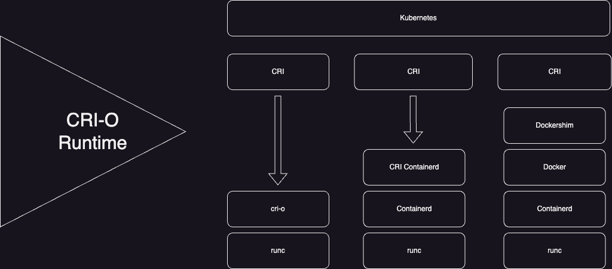
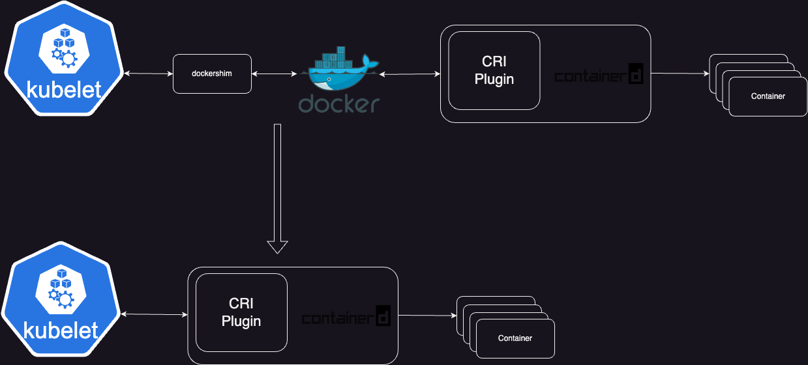

# Certified Kubernetes Administrator

## Kubeconfig

Kubeconfig contains the configuration required for user authentication, authorization, and the permissions to communicate with the Kubernetes API server.

It is located in the .kube directory. On a Mac, the path would be:

```
vim /Users/<username>/.kube/config
```

The structure of Kubeconfig is similar to a Kubernetes manifest, with fields like apiVersion. Under the **clusters** section, there is a **cluster** object, which includes a subfield called **certificate-authority-data**. This field is responsible for authenticating the user with the cluster.

Additionally, the **server** field defines the full domain name for accessing the cluster, while the **name** field under clusters provides the cluster's identifier.

After the cluster information (or clusters if you are working with multiple clusters), there is a section called **contexts**. This section includes a sub-field named **context**, which enables you to connect to different clusters.

Note: The cluster you are currently connected to is specified by the **current-context** field.

Next, you have the user information, which defines how you authenticate with the clusters. The most crucial part of this section is the **client-certificate** information, as it determines the user's authentication, authorization, and permissions to interact with the cluster.

## Kubernetes Control Plane and Worker node breakdown (high level).

| Control Plane Component | Worker Node Component |
| ----------------------- | ---------------------|
| API Server: API is used to connect to kubernetes and deploy workload. | Kubelet: Kubernetes agent. |
| ETCD: ETCD is the database for kubernetes and it store any non-ephemeral data. | Kube-proxy: Does the internal networking for the Kubernetes. |
| Scheduler: Deploys the pods onto the desired worker node. | CRI: Container runtime interface. Kubernetes inherently dosen't know how to run containers and hence it uses CRI plugin to provide the runtime environment for containers. |
| Controller: Confirms the current states is the desired state of all the running workloads. | CoreDNS: CoreDNS handles all the dns capabilites inside the Kubernetes. |

**Note: The recommended number of control plane nodes is 3, primarily due to ETCD. ETCD uses an algorithm called RAFT, which requires leader election— a process to determine which control plane node serves as the leader at any given time.**

## API Server.

The Kubernetes API Server defines the methods of storing and interacting with various Kubernetes API's.


## Scheduler

The Kubernetes scheduler is a control plane process which assigns Pods to Nodes. The scheduler determines which Nodes are valid placements for each Pod in the scheduling queue according to constraints and available resources. The scheduler then ranks each valid Node and binds the Pod to a suitable Node. 


## ETCD

Kubernetes uses Etcd, a key-value store, often thought of as Kubernetes' database. It stores vital state information such as pod details and secrets (like API keys or passwords). If the control plane or a worker node goes down, this data is preserved because it's stored in Etcd, not in-memory. In short the state of the Kubernetes cluster itself (like pod status) is stored in Etcd.

For Kubernetes to be highly available (HA), Etcd can be run on separate servers. This setup ensures redundancy and enables leader election via the Raft algorithm, which is used to determine the active control plane in a multi-plane environment. The system typically requires 3 or more control planes for leader election to function effectively.

## Controller

Controller in Kubernetes plays a key role in maintaining the "self-healing" feature, which ensures that resources like pods are automatically restored when they go down.

For instance, if you have a deployment with three pods and one goes down, the **ReplicaSet Controller** detects this discrepancy and tries to restore the pod until the desired number of pods is running again. This is achieved through a **reconciliation loop**, a mechanism that continuously checks and adjusts resources until the desired state is reached.

This process applies not just to pods but also to other resources managed by Kubernetes controllers, including third-party tools like Argo CD. The reconciliation loop is essential to Kubernetes' ability to automatically recover and ensure resource availability, making manual interventions unnecessary.

In summary, the **Controller** ensures self-healing by constantly aligning the current state with the desired state using controllers like ReplicaSet and their reconciliation loops.

## Kubelet

The kubelet has several key responsibilities:

- It installs an agent on each worker node in the Kubernetes cluster.
- It registers each worker node to the cluster, providing information such as CPU and memory resources. This helps the cluster know the total resources available for running pods and workloads.
- When new worker nodes are added, the kubelet automatically registers them with the control plane.
- It continuously watches the API server for new tasks and executes them.
In summary, the kubelet ensures that each worker node is properly registered and manages resource allocation, while monitoring the API server for tasks to run.

## Kube-proxy 

The **kube-proxy** plays a crucial role in **local cluster networking** within a Kubernetes environment. It ensures that each node in the cluster gets a unique IP address and manages **IP tables** or **IPVS rules**, which control networking at the node level.

Key responsibilities of kube-proxy:
- Assigns unique IP addresses to nodes in the cluster.
- Manages IP tables and IPVS rules to handle network traffic within the cluster.
- It focuses on **local cluster networking** rather than handling the networking for individual workloads (pods, services, etc.). The networking for workloads is managed by the **CNI (Container Network Interface)**.
- kube-proxy also helps with the networking of **static pods** when components like the API server and controller manager run as static pods in a Kubernetes setup (e.g., during cluster bootstrapping with **kubeadm**).

In summary, kube-proxy manages node-level networking by assigning IPs and controlling IP tables to ensure smooth cluster communication.

## CRI 

Kubernetes executes containers using the Container Runtime Interface (CRI). The CRI is essential because Kubernetes, by itself, cannot run containers. It needs the CRI to manage and run containerized workloads.

Here's how it works:

- In a Kubernetes cluster, there are control planes and worker nodes. The control planes handle tasks like scheduling workloads, while worker nodes run the actual workloads.
- When a developer submits a request (e.g., using kubectl apply -f), it goes to the API server in the control plane, which schedules it to a worker node.
- The worker node runs pods, which contain containers. However, Kubernetes doesn't have the capability to run containers directly, which is where the CRI comes in. It acts as a plugin that enables Kubernetes to interact with containers.
- Kubernetes is designed to be modular and customizable, with various plugins (like the CRI) that can be tailored to different environments.

In short, Kubernetes relies on the CRI plugin to manage containers, emphasizing the modular, extendable design of the system to allow for flexibility in how workloads are handled.

## CRI-O Runtime

The key points are:
- **CRI Compliant**: Being CRI compliant means following guidelines from the **Open Container Initiative** (OCI), which sets best practices for running containers.
- **CRI-O**: One option for a CRI-compliant runtime is **CRI-O**, which is optimized for Kubernetes and works well with tools like **kubeadm**. It directly integrates with Kubernetes, making it efficient and fast.
- **Docker Runtime Deprecation**: Previously, Kubernetes used the **Docker** runtime, which relied on a middle layer called **dockershim** to communicate with Kubernetes. However, this added complexity and has since been deprecated in favor of using **containerd** directly, which simplifies communication and speeds up container runtime.
- **CRI-O vs. Docker**: Unlike Docker, CRI-O bypasses the middle layer and interacts directly with the container runtime, potentially offering faster performance.

In summary, Kubernetes uses plugins like **CRI-O** to run containers efficiently, and the move away from Docker has streamlined this process.



## Containerd runtime

**containerd**, another important **Container Runtime Interface (CRI)** option in Kubernetes, focusing on its features and usage.

Key points:
1. **containerd** is a **graduated CNCF project** and works on both **Windows** and **Linux**. This is particularly useful for legacy applications like .NET apps, which may require Windows worker nodes.
2. Kubernetes is evolving into a "platform of platforms," supporting a wide range of applications, from microservices and monoliths to virtual machines, enhancing its flexibility.
3. Like **CRI-O**, containerd is **Open Container Initiative (OCI) compliant**, ensuring it follows best practices for container runtime.
4. **Cloud Services**: containerd is the default runtime for managed Kubernetes services like **Azure Kubernetes Service** (AKS) and **Elastic Kubernetes Service** (EKS).
5. **Docker Deprecation**: Kubernetes used to rely on **Docker** for container management, but it required an additional layer called **Docker Shim** to communicate with Kubernetes. This added complexity and performance overhead. Now, Kubernetes interacts directly with containerd, eliminating Docker Shim, streamlining performance, and reducing management tasks.
6. **containerd in Kubernetes**: As of **Kubernetes version 1.24**, Docker Shim has been removed, and containerd or CRI-O are the standard container runtimes used.

In summary, **containerd** has become a core runtime in Kubernetes, simplifying container management, especially in cloud-managed services.


